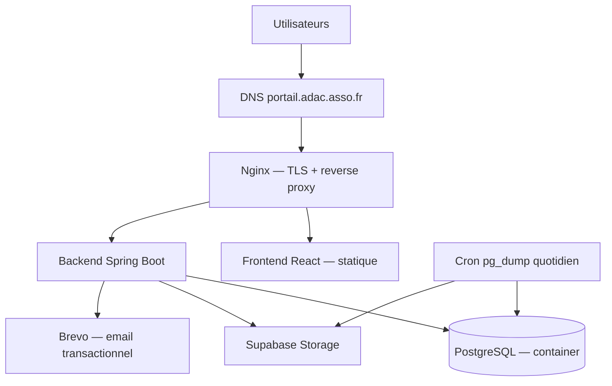

# Infrastructure Architecture — Portail de Formation ADAC

> Source de vérité pour le runtime et le déploiement. Voir `INFRA_REQUIREMENTS.md` pour les besoins qui
> justifient chaque choix ci-dessous. Voir `DEPLOYMENT.mmd` pour le schéma.

## 1. Requirements Summary
Petite association, budget modeste mais pas prioritaire sur la fiabilité, **aucune maintenance continue
garantie** (projet bénévole), <300 utilisateurs, usage heures ouvrées, RGPD/UE obligatoire, hébergement hors
NAS interne ADAC.

## 2. Architecture Decision Summary

Vue d'ensemble en un coup d'œil — le détail et le "pourquoi" de chaque ligne sont dans les sections dédiées
plus bas (2 à 25), pas ici.

- **Frontend hosting** — container Nginx (build React statique) sur le VPS
- **Backend hosting** — container Spring Boot (JAR) sur le VPS
- **Database** — PostgreSQL self-hosted dans Docker Compose, automatisé à fond (→ section 5)
- **Docker** — oui
- **Orchestration** — Docker Compose (pas de Kubernetes)
- **Cloud / hosting** — VPS EU, Hetzner ou Scaleway (→ section 9)
- **CI/CD** — GitHub Actions : tests + build automatiques ; déploiement déclenché manuellement (→ sections 14-15)
- **IaC** — non, pas de Terraform
- **DNS** — `portail.adac.asso.fr`, déjà géré par l'ADAC (→ section 10)
- **TLS** — Let's Encrypt via Nginx + Certbot, renouvellement automatique (→ section 11)
- **Monitoring** — uptime check externe gratuit + `/actuator/health` (→ section 20)
- **Backups** — `pg_dump` quotidien automatisé vers Supabase Storage (→ section 22)

**Les deux choix qui méritent une explication à part** (les autres sont conséquences directes du budget/de
la taille du projet) :

- **Pourquoi Postgres self-hosted plutôt que managé ?** Une base managée coûterait 13-25 €/mois de plus
  qu'un VPS seul — un vrai saut de budget, pas un détail. Le self-hosted automatisé (backups + healthchecks
  + patchs OS auto) supprime l'essentiel de la charge manuelle sans ce surcoût. Détail complet en section 5.
- **Pourquoi un déploiement manuel plutôt qu'automatique ?** Personne n'est d'astreinte sur ce projet
  (bénévole) — un déploiement qui se déclenche tout seul sans surveillance est plus risqué qu'un bouton
  pressé consciemment. Détail en section 15.

## 3. Deployment Topology

`DEPLOYMENT.mmd` (voir fichier séparé) :



## 4. Frontend Deployment
> Le code frontend vit dans un repo séparé (`ADAC-Formation/front`, géré par Manon) — ce repo ne le build pas,
> il **pull** l'image déjà construite par le CI de ce repo. Les points ci-dessous sont la spec que Manon doit
> suivre dans son repo, partagée ici pour traçabilité.

- Build : `npm run build` → fichiers statiques servis par Nginx
- Runtime : Nginx (déjà prévu dans STACK.md)
- Env vars : `VITE_API_URL` injectée au build
- `front/Dockerfile` (dans le repo front) : stage build (node) → stage runtime (nginx:alpine), port 80 exposé
  en interne au réseau Docker
- Le repo front pousse son image vers `ghcr.io/adac-formation/front` (même registry que le backend) — voir
  section 16

## 5. Backend Deployment & Database — la décision centrale

**Comparatif self-hosted vs managé, au regard des vraies contraintes (budget modeste + zéro maintenance
continue garantie) :**

- **Self-hosted (Docker, sur le VPS)**
  - Coût : inclus dans le VPS (~5-8 €/mois tout compris)
  - Backups : à automatiser une fois (cron + upload), ensuite zéro intervention
  - Patchs OS/DB : `unattended-upgrades` sur le VPS = quasi automatique
  - Fiabilité perçue : bonne si healthchecks + auto-restart configurés
  - Complexité initiale : un peu plus de configuration à faire une fois (ce ticket)
- **Managé (ex. Neon / Scaleway Managed DB)**
  - Coût : +13 à 25 €/mois selon fournisseur
  - Backups : automatiques par défaut
  - Patchs OS/DB : aucun, géré par le fournisseur
  - Fiabilité perçue : meilleure par défaut, mais souvent avec un palier gratuit limité (cold start / quota)
  - Complexité initiale : moins de configuration initiale

**Décision : self-hosted, mais entièrement automatisé** — pas de compromis "moins cher mais fragile". Concrètement :
- `restart: unless-stopped` + healthcheck Docker sur le container `db` (pas de dépendance à `depends_on` seul)
- Sauvegarde quotidienne automatique (voir section 23) sans étape manuelle une fois en place
- `unattended-upgrades` activé sur le VPS pour les patchs de sécurité OS
- Alerte automatique (uptime check, section 21) si le service tombe — pas besoin de surveiller activement

**Revisit when** : si le volume de données dépasse largement les prévisions, si un vrai budget de
fonctionnement est débloqué par l'ADAC, ou si la restauration de backup échoue une fois testée — migrer vers
une base managée (Neon EU ou Scaleway Managed PostgreSQL) devient alors justifié.

Backend :
- Java 21, build Maven, artefact JAR unique
- Port 8080, interne uniquement (jamais exposé publiquement — seul Nginx l'atteint)
- `back/Dockerfile` : multi-stage, builder Maven+Java 21 → runtime JRE 21, utilisateur non-root, `HEALTHCHECK`
  sur `/actuator/health`
- Arrêt gracieux : `server.shutdown=graceful` (Spring Boot)

## 6. File/Object Storage
Supabase Storage (déjà en place) — pas de changement. Free tier suffisant pour la volumétrie attendue
(section 3 de INFRA_REQUIREMENTS.md).

## 7. Docker — inventaire complet

Fichiers dans **ce repo** (`back`) :
```text
/
├── .env.example
├── docker-compose.yml
├── back/
│   ├── Dockerfile
│   └── .dockerignore
└── nginx/
    ├── nginx.conf
    └── certbot/           ← volume pour les certificats Let's Encrypt
```

Fichiers dans le **repo front** (Manon, hors de ce repo) :
```text
/
├── front/Dockerfile
└── front/.dockerignore
```

- **`db`** — image `postgres:16` — base de données — port 5432 — **non public**, réseau interne uniquement —
  persistant (volume `postgres_data`)
- **`backend`** — construite depuis `back/Dockerfile` de ce repo — API Spring Boot — port 8080 — **non
  public**, réseau interne uniquement — non persistant
- **`frontend` (Nginx)** — image **pull** depuis `ghcr.io/adac-formation/front:<tag>` (construite par le CI du
  repo front, pas buildée ici) — sert le build React + reverse proxy `/api` + TLS — ports 80 et 443 — public —
  non persistant (config Nginx montée en volume depuis ce repo)

**Réseau** : un seul réseau Docker `app_network` ; seul `frontend` publie des ports vers l'hôte.
**Ports** : `db` et `backend` retirés de tout mapping `ports:` public en production (corrige l'exposition
actuelle de 5432/8080 documentée dans ARCHI.md).

**Health checks** :
```text
db      → pg_isready -U ${DB_USERNAME}
backend → curl -f http://localhost:8080/actuator/health
frontend→ curl -f http://localhost/  (une fois backend healthy)
```
`depends_on` seul ne suffit pas : ajouter `condition: service_healthy` sur les dépendances dans
`docker-compose.yml` pour que `backend` attende réellement que `db` accepte les connexions.

**Variables d'environnement** — clarification de la propriété (corrige l'ambiguïté actuelle) :
- `.env` (racine, non commité) : lu par `docker-compose.yml` pour l'interpolation `${...}` — c'est la
  **seule** source de vérité en Docker (remplace toute notion de `back/.env` séparé une fois containerisé)
- `.env.example` (racine, commité) : template sans valeurs réelles
- `back/src/main/resources/application-*.properties` : ne contiennent que des références `${VAR}` résolues
  par les variables d'environnement injectées par Compose — jamais de valeur en dur

## 8. Orchestration
Docker Compose uniquement. Kubernetes non justifié (un seul hôte, une seule instance de chaque service,
pas d'exigence de scaling ou de HA — voir section 26).

## 9. Cloud / Hosting Provider
VPS EU — Hetzner CX22 ou Scaleway DEV1-S (2 vCPU / 4 Go RAM, ~5-6 €/mois) : suffisant pour 3 containers à
ce niveau de trafic, région UE (RGPD), facturation fixe et prévisible.

## 10. DNS & Domain
`portail.adac.asso.fr` → enregistrement A/AAAA pointant vers l'IP du VPS. DNS déjà géré par l'ADAC (domaine
`adac.asso.fr` existant).

## 11. TLS / HTTPS
Let's Encrypt via Certbot, intégré au container Nginx (renouvellement automatique par cron interne au
container ou job Certbot dédié). **Corrige l'incohérence actuelle** : la config Nginx doit inclure un bloc
`listen 443 ssl;` avec les chemins de certificats montés en volume, en plus du bloc `listen 80;` qui ne fait
que rediriger vers HTTPS.

## 12. Reverse Proxy
```text
/        → frontend (fichiers statiques React)
/api/    → backend:8080
```
En-têtes transmis : `X-Forwarded-For`, `X-Forwarded-Proto`. Fallback SPA (`try_files ... /index.html`).

## 13. Environments
- **Local** — infra : Docker Compose local ou run direct — database : Postgres local — domaine : localhost
- **Production** — infra : VPS unique — database : Postgres container sur le même VPS —
  domaine : portail.adac.asso.fr

Pas de staging au lancement (cf. INFRA_REQUIREMENTS.md section 5) — à réévaluer si des changements risqués
deviennent fréquents.

## 14. CI
GitHub Actions sur chaque PR vers `dev`/`main` : tests backend (JUnit), tests frontend (Vitest), build des
deux images Docker (validation, sans push).

## 15. CD
```text
merge sur main → build images → push registry → connexion SSH au VPS → docker compose pull && up -d
→ vérification /actuator/health → succès / rollback (redeploy du tag précédent)
```
Déclenchement manuel (bouton GitHub Actions) au départ plutôt qu'automatique — évite un déploiement surprise
sans personne pour surveiller, cohérent avec "pas de maintenance continue garantie".

## 16. Registry
GitHub Container Registry (gratuit avec le repo GitHub existant). Tags versionnés (`v1.0.0`, jamais
uniquement `latest` en production) pour permettre un rollback simple.

## 17. Secrets Management
`.env` sur le VPS (jamais commité), permissions restreintes au user de déploiement. Secrets concernés :
`DB_PASSWORD`, `JWT_SECRET`, `MAIL_PASSWORD` (Brevo), `SUPABASE_KEY`. Rotation : manuelle, à la charge de
Charlotte en cas de suspicion de fuite — pas de rotation planifiée vu le contexte bénévole.

## 18. Database Migrations
Flyway (ajout recommandé au backend) — jamais `ddl-auto=update` en production. Migrations versionnées dans
`back/src/main/resources/db/migration/`.

## 19. Logging
stdout/stderr des containers (capturé par Docker), format texte simple. Rétention : logs Docker par défaut
(rotation via `max-size`/`max-file` dans `docker-compose.yml` pour éviter de saturer le disque du VPS).

## 20. Monitoring & Uptime
Uptime check externe gratuit (UptimeRobot ou équivalent) sur `https://portail.adac.asso.fr/actuator/health`,
alerte email à Charlotte si down. Pas de stack Prometheus/Grafana — injustifié à cette échelle.

## 21. Health Checks
`/actuator/health` exposé (Spring Boot Actuator) — endpoints sensibles Actuator **non exposés publiquement**
(seul `/health` autorisé via la config Nginx/Spring Security).

## 22. Backups
- **Quoi** : dump complet PostgreSQL (`pg_dump`)
- **Fréquence** : quotidienne (cron sur le VPS ou dans un container dédié)
- **Rétention** : 14 jours glissants
- **Stockage** : bucket Supabase Storage dédié (`adac-backups`), chiffré au repos par Supabase
- **Restauration** : `psql < backup.sql` documenté dans un runbook (`docs/RESTORE.md` à créer)
- **Test de restauration** : à faire une fois après mise en place, puis tous les 3 mois (rappel calendrier)

## 23. Scaling
Vertical uniquement, manuel (changer de taille de VPS si besoin). Pas d'autoscaling — aucune exigence ne le
justifie à ce trafic.

## 24. Security
TLS partout, ports `db`/`backend` non exposés publiquement, accès SSH au VPS restreint (clé uniquement, pas
de mot de passe), secrets hors du repo, `unattended-upgrades` pour les patchs OS automatiques. Le détail
applicatif (CSRF, cookie JWT) est couvert dans `ARCHI.md`.

## 25. Cost Estimate

- VPS (Hetzner CX22 / Scaleway DEV1-S) : 5-6 €
- Domaine : déjà possédé, 0 €
- Supabase Storage : 0 € (free tier)
- Brevo email : 0 € (free tier, 300/jour)
- Let's Encrypt TLS : 0 €
- Uptime monitoring : 0 € (free tier)
- **Total : ~5-6 €/mois**

À vérifier : tarifs actuels Hetzner/Scaleway au moment de la souscription (susceptibles d'évoluer).

## 26. Trade-offs

### Kubernetes
Décision : non retenu. Un seul hôte, une seule instance de chaque service, pas d'exigence HA.
Trade-off : moins de flexibilité d'orchestration. Revisit when : plusieurs services indépendants,
forte exigence de disponibilité, ou une équipe DevOps rejoint le projet.

### Base de données managée
Décision : non retenue au lancement (voir section 5). Trade-off : Charlotte doit configurer backups +
healthchecks une fois correctement. Revisit when : budget débloqué par l'ADAC, ou incident de fiabilité.

### Déploiement CD automatique
Décision : déclenchement manuel au départ. Trade-off : un oubli de déployer une correction urgente si
personne n'est disponible. Revisit when : la fréquence de déploiement augmente ou une astreinte est mise
en place.

## 27. Revisit Triggers
- Plus de ~500 utilisateurs actifs ou trafic significativement plus élevé que prévu
- Un test de restauration de backup échoue
- L'ADAC débloque un budget de fonctionnement dédié
- Un deuxième backend/service indépendant apparaît
- Une exigence de disponibilité 24/7 stricte apparaît

## 28. Required Repository Files

Dans **ce repo** (`back`) :
- `docker-compose.yml` — orchestration des 3 containers en prod (pull frontend, build backend) — INFRA-011
- `.env.example` — template des variables d'environnement — INFRA-011
- `back/Dockerfile` — image backend — INFRA-009
- `back/.dockerignore` — exclusions build backend — INFRA-009
- `nginx/nginx.conf` — reverse proxy + TLS + SPA fallback — INFRA-004, INFRA-005
- `back/src/main/resources/db/migration/` — migrations Flyway — INFRA-013 (déjà TICKET-004 côté tickets)
- `docs/RESTORE.md` — runbook de restauration backup — INFRA-007
- `.github/workflows/ci.yml` — tests + build image backend — INFRA-008
- `.github/workflows/deploy.yml` — déploiement manuel déclenché — INFRA-010

Dans le **repo front** (Manon, hors de ce repo — spec fournie ici pour traçabilité) :
- `front/Dockerfile` — image frontend, poussée vers `ghcr.io/adac-formation/front`
- `front/.dockerignore`
- son propre `.github/workflows/ci.yml` (tests + build + push image)

## 29. Implementation Specification

```markdown
## Docker — backend (back/Dockerfile)
- Multi-stage : builder Maven 3.9 + Java 21, runtime JRE 21 (eclipse-temurin)
- Copie uniquement le JAR final
- Utilisateur non-root
- HEALTHCHECK sur /actuator/health
- Port 8080 exposé au réseau Docker interne seulement
- Aucun secret en dur dans l'image

## Docker — frontend (front/Dockerfile — dans le repo front, spec à suivre par Manon)
- Stage build : node:20-alpine → npm run build
- Stage runtime : nginx:alpine, sert /usr/share/nginx/html
- CI du repo front pousse l'image vers ghcr.io/adac-formation/front:<tag>

## docker-compose.yml (ce repo)
- 3 services (db, backend construits ici — frontend en `image:` pull) sur le réseau app_network
- healthcheck + condition: service_healthy sur chaque dépendance
- restart: unless-stopped sur les 3 services
- volume postgres_data pour db, volume certbot pour les certificats TLS
- Config Nginx custom (nginx/nginx.conf, dans ce repo) montée en volume dans le container frontend

## Backup script
- Cron quotidien (VPS ou container dédié) : pg_dump → upload Supabase Storage bucket adac-backups
- Purge des dumps > 14 jours
```

## 30. Required Tickets

Numérotées `TICKET-XXX` dans `docs/tickets/` (voir `TICKETS.md` pour l'ordre chronologique complet) :

```text
TICKET-009 — Créer le Dockerfile backend
TICKET-011 — Créer docker-compose.yml + .env.example (production, pull frontend / build backend)
TICKET-037 — Configurer le reverse proxy Nginx (routes + SPA fallback)
TICKET-038 — Configurer TLS (Let's Encrypt/Certbot)
TICKET-039 — Retirer l'exposition publique des ports db/backend
TICKET-040 — Script de sauvegarde automatique + runbook de restauration
TICKET-012 — Pipeline CI (tests + build image backend)
TICKET-002  — Provisionner le VPS + DNS
TICKET-041 — Pipeline CD (déploiement manuel déclenché)
TICKET-042 — Configurer uptime monitoring
TICKET-013 — Activer unattended-upgrades sur le VPS
TICKET-004  — Introduire Flyway pour les migrations DB
```

**Hors de ce repo** — à faire par Manon dans `ADAC-Formation/front` (spec fournie ici, pas un ticket de ce
repo) : Dockerfile frontend + son propre pipeline CI qui pousse l'image vers `ghcr.io/adac-formation/front`.

## 31. Required Specialized Skills

```text
/docker
/nginx
/github-actions
```
(Pas de Terraform, Kubernetes, ni cloud provider spécifique — non sélectionnés ci-dessus.)

## Validation Checklist
- [x] Chaque choix se rattache à un besoin validé dans INFRA_REQUIREMENTS.md
- [x] Docker justifié ; Kubernetes explicitement écarté avec raison
- [x] Persistance DB, backups et procédure de restauration définis
- [x] Ports publics et terminaison TLS explicites
- [x] Propriété des variables d'environnement explicite ; aucun secret réel dans ce document
- [x] CI et CD distingués
- [x] Stratégie health/readiness définie (corrige le `depends_on` seul de la version précédente)
- [x] Fichiers du repo listés ; détail suffisant pour la génération de tickets
- [x] Trade-offs et déclencheurs de révision documentés
- [ ] Validé par Charlotte

_Généré le 2026-08-24 — révision rétroactive du projet ADAC via step-05d_
